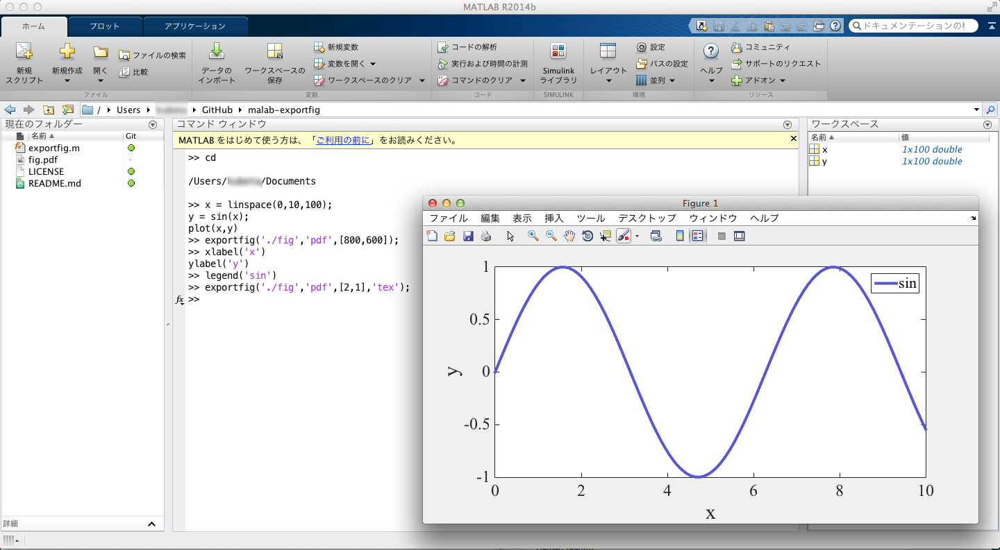

# matlab-exportfig

Matlab function to export figure by your rules.

### Usage
1. Put **exportfig.m** on matlab home directory or add path of a directory including **exportfig.m**.
2. Plot your figure. You can use subplot function.
3. Select your figure window.
4. Write ```exportfig('./fig','pdf',[800 600])``` on console and run.
5. Figure window is resized, and  "fig.pdf" of 800x600 px is in current directory.

### Function
```
exportfig(filename,format, m)
exportfig(filename,format, m, type )
```
* filename : filename without format name.
* format : image format including .eps, .pdf, .tiff, etc.
* m : size or aspect ratio of image.
* type(optional): export format; 'TeX', 'TeX\*', 'Slides' and 'Poster'.

### Type
The argument *type* changes figure-size, font-size, font-family and line width.
* TeX and TeX\*, for LaTeX figures
* Slides, for Presentation slides
* Poster, for Poster

#### 'TeX' figure fits following figure environments of LaTeX.
```LaTeX
\begin{figure}[tbp]
	\centering
	\includegraphics[width=\linewidth]{fig.pdf}
	\caption{default
	\label{default}
	}
\end{figure}
```

#### 'TeX\*' figure fits following figure\* environments of LaTeX.
```TeX
\begin{figure*}[tbp]
	\centering
	\includegraphics[width=\linewidth]{fig.pdf}
	\caption{default
	\label{default}
	}
\end{figure*}
```


# Images

Plot your data.


Resize your figure as 800x600 image.


Your plot as 800x600 image. 


Apply *TeX* to your figure
